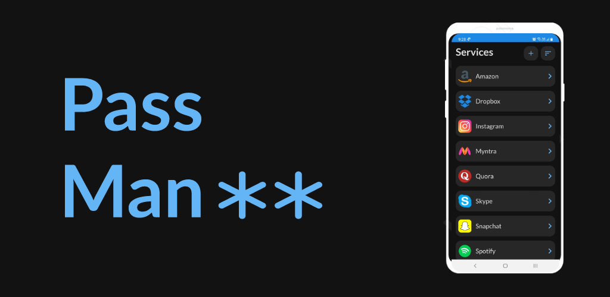

<h1 align="center">PassMan</h1>
   
  

   
  
<h2 align="center">Features</h2>

- Password manager for android.
- It can be used to store and manage passwords for any service in an encrypted manner.
- It has a 4 digit passcode to enter the app to securely store the passwords locally along with the app being completely offline.
- Biometric authentication if enabled on device.
- Password generating functionality is also provided in the application.
- Room database is used to store passwords and other information.
- Passwords are encrypted using Advanced Encrytion Standard (AES) before storing in database.
- MVVM architecture is used for ui.

<h2 align="center">Download</h2>

***Latest PassMan apk👇***
 
 

<h2 align="center">Screenshots</h2>

|   Passcode Screen    | All Services    |   Add Service   
|---	|---	|---
|      |      |       

|   Service Details  |   Generate Password    | Add Passcode    |
|---    |---	|---	|
|       |         |   

 

